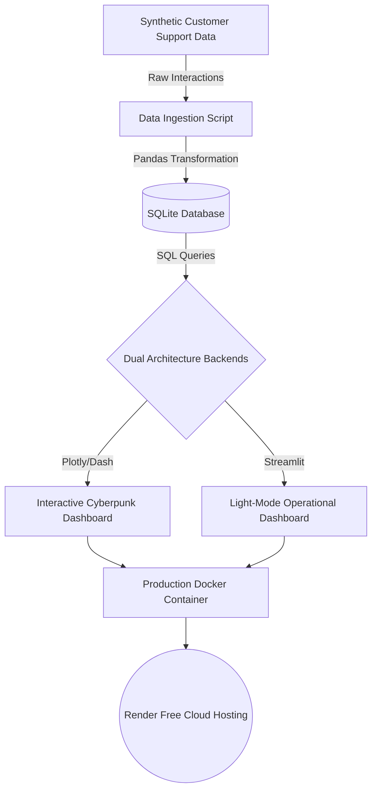

# ✈️ Online Travel Agency (OTA): Intelligence Dashboard

    

A production-grade, dual-architecture telemetry dashboard designed to track, visualize, and analyze Customer Support Chatbot KPIs for Online Travel Agencies (OTAs).

🚀 **Live Deployment:** [https://chatbot-kpi-pipeline.onrender.com/](https://chatbot-kpi-pipeline.onrender.com/) *(Note: Hosted on free tier. If the site hangs, please allow 1-2 minutes for the server to wake up.)*

---

## 🧐 What is this?
The **OTA Intelligence Dashboard** is a full-stack data visualization project. It takes raw, unstructured customer service chat logs (intents, fallback rates, takeover requests, handling times) and transforms them into an interactive, real-time command center. 

Uniquely, this project features a **Dual-Architecture design**, meaning the same underlying data pipeline powers two completely different frontend experiences:
1. **The Dash App (`src/dash_app.py`)**: A premium, highly interactive, cyberpunk-themed interface built with Plotly Dash, featuring a collapsible sidebar, hover tooltips, and dynamic visualizers.
2. **The Streamlit App (`src/streamlit_app.py`)**: A clean, light-mode, rapid-prototyping interface designed for quick operational glances.

## 🎯 Why was it built?
Chatbots are only as good as the data they generate. Product Managers and Support Leads need to know *exactly* when and why a chatbot fails. This dashboard was built to solve the **"Black Box Chatbot" problem** by surfacing core KPIs and tracking the exact interactions that trigger "Human Takeovers" or "Fallbacks".

## ⚙️ How does it work? (The Data Pipeline)



### 🛠️ The Tech Stack
*   **Data Engineering:** `pandas` (for parsing, feature engineering, and KPI math operations).
*   **Database:** `SQLite3` (lightweight, zero-config relational persistence).
*   **Frontend A (Premium):** `dash`, `dash-bootstrap-components`, `plotly.express`, `plotly.graph_objects` (for the highly interactive, dynamic React-based dashboard).
*   **Frontend B (Operational):** `streamlit` (for the rapid-prototyping, light-mode interface).
*   **DevOps & Deployment:** `Docker` (containerization), `gunicorn` (production WSGI server), `uv` (ultra-fast Python package management).

### Data Collection & Engineering
The primary dataset powering this dashboard relies on synthetic customer support interactions generated via [Bitext (Customer Support LLM Chatbot Training Dataset)](https://huggingface.co/datasets/bitext/Bitext-customer-support-llm-chatbot-training-dataset). 

**1. Original Data (From Hugging Face)**
The original Bitext dataset provides the foundation of realistic chat logs. It contains the following core columns:
*   `instruction`: The raw message or question asked by the customer.
*   `intent`: The classified intent of the message (e.g., "cancel_order", "track_refund").
*   `category`: The broader category the intent belongs to.
*   `response`: The AI's ideal response to the instruction.
*   `flags`: Additional metadata flags.

**2. Synthetic Data Generation**
Because the original dataset only contained raw text and basic intents, we augmented it by engineering and populating dummy (synthetic) data into new columns. These columns were strictly necessary to calculate the advanced metrics shown on the dashboard:

*   `timestamp`: Randomly generated dates over a 30-day period. (Used for all **Temporal Visualizations** and Time Filters).
*   `average_handling_time`: Simulated conversation duration in seconds. (Used for the **Average Handling Time** metric).
*   `user_id`: Synthetic user identifiers with a weighted probability for recurring visits. (Used for the **Return Users** metric).
*   `is_fallback`: Boolean indicating if the AI failed to understand the intent. (Used for the **Fallback Rate** metric).
*   `human_takeover`: Boolean indicating if the chat was escalated to a human agent. (Used for the **Human Takeover Rate** metric).
*   `is_resolved`: Boolean indicating if the issue was fully resolved. (Used for the **First Contact Resolution** metric).
*   `csat_score`: An integer (1-5) rating weighted against whether the chat was resolved or handed over. (Used for the **Customer Satisfaction** metric).
*   `converted`: Boolean indicating if the user completed a desired action. (Used for the **Conversion Rate** metric).
*   `would_be_ticket`: Boolean indicating if the query was complex enough to have otherwise become a support ticket. (Used for the **Ticket Deflection** metric).

> [!WARNING]
> **Data Disclaimer:** Because the metrics are calculated using this heavily augmented dummy data, the resulting KPI values, trends, and charts shown in the dashboard are simulated and may be incorrect or unrealistic compared to real-world production environments. They serve purely as a demonstration of the dashboard's capabilities.

The data engineering process operates as follows:
1. **Ingestion & Parsing (`src/ingest.py`)**: Raw chat logs are ingested from Hugging Face.
2. **Feature Engineering (`src/process.py`)**: The pipeline loops through the original logs and systematically generates the synthetic KPI markers mentioned above using statistical probabilities.
3. **Persistence (`src/database.py`)**: The fully augmented pandas DataFrame is injected into a lightweight `SQLite` database (`data/chatbot_metrics.sqlite`) for ultra-fast, local retrieval without the need for external cloud database connections.

## 📊 The 3 Categories of Chatbot Metrics
*(Metric definitions and categories are heavily inspired by and credited to [omq.ai's Chatbot KPI Lexicon](https://omq.ai/lexicon/chatbot-kpi/)).*

Before we dive into the individual KPIs tracked by this dashboard, it’s worth grouping them into three overarching categories:

| Category | Metrics | Key question |
| :--- | :--- | :--- |
| **🤖 Efficiency** | Automation rate, fallback rate, human takeover rate, AHT, resolution rate | How well is the chatbot working? |
| **😊 Customer experience** | CSAT score, positive/negative ratings, return visitor rate | How do customers experience the chatbot? |
| **📈 Business impact** | Conversion rate, ticket deflection rate, ROI | What does the chatbot deliver for the business? |

> [!IMPORTANT]
> All three categories are equally important. A chatbot that is highly efficient but produces poor customer satisfaction is optimising the wrong side of the equation. Only by looking at all three together do you get a complete picture.

---

### 1. Automation Rate
The automation rate is the headline metric among chatbot KPIs. It shows what percentage of all incoming customer enquiries your chatbot resolves completely without human intervention.
*   **Formula:** (Enquiries fully resolved by the chatbot / Total enquiries) × 100
*   **Benchmark:** 70–85% – Well-optimised AI chatbots in customer service consistently reach these figures. Rates below 50% point to an inadequate knowledge base or insufficient training.
*   **How to improve it:** Above all, the quality of the knowledge base. The more precise and complete the answers to common customer questions stored in the system, the less often a human agent needs to step in.

### 2. Resolution Rate (First Contact Resolution)
While the automation rate measures how many enquiries the bot answers, the resolution rate asks: were those enquiries actually resolved? A chatbot can respond without fixing the customer’s underlying problem – and that’s exactly what needs to be avoided.
*   **Formula:** (Enquiries resolved at first contact / Total enquiries) × 100
*   **Benchmark:** > 65% – For AI systems with a strong knowledge base, figures of 75–90% are achievable.
*   **How to improve it:** Regularly check which enquiries were answered but then resubmitted. These patterns reveal where answer quality is falling short.

### 3. Human Takeover Rate
The human takeover rate shows how often a chatbot has to hand a conversation over to a human agent. It is the direct counterpart to the automation rate – and reveals where the AI reaches its limits.
*   **Formula:** (Number of handovers to agent / Total conversations) × 100
*   **Benchmark:** < 25% – A good rule of thumb for most industries.
*   *Note: A low human takeover rate is only a positive sign if the CSAT score is simultaneously high. A chatbot that never hands over but also never truly helps is optimising the wrong metric.*

### 4. Customer Satisfaction (CSAT Score)
The Customer Satisfaction Score (CSAT) measures directly how satisfied users were with their chatbot conversation.
*   **Formula:** (Number of positive ratings / Total ratings) × 100
*   **Benchmark:** > 80% – Good chatbot systems achieve CSAT scores of 80% and above.
*   **How to improve it:** Break the CSAT score down by topic area. The chatbot may score very well on standard questions but poorly on specific product queries. That level of granularity is invaluable for targeted optimisation.

### 5. Fallback Rate
The fallback rate shows how often the chatbot was unable to understand an enquiry at all and responded with a generic error message. It is a direct measure of the quality of the NLP or AI model.
*   **Formula:** (Number of fallback responses / Total conversations) × 100
*   **Benchmark:** < 10% – Below 5% is excellent.
*   **How to improve it:** Address overly narrow question formulations in training, insufficient synonym coverage, inadequate context processing, or missing content for certain topic areas.

### 6. Average Handling Time (AHT)
Average Handling Time (AHT) measures how long a chatbot conversation takes on average. For chatbots, this differs fundamentally from AHT in human support: a quickly closed conversation is not inherently good – it could indicate an abandoned conversation or a frustrated drop-off.
*   **Formula:** Total conversation duration / Number of conversations
*   **Benchmark:** 2–5 minutes – For standard customer service enquiries.
*   **How to improve it:** Segment AHT by enquiry type. Short conversations for simple questions (opening hours) and longer ones for complex topics (technical support) is a healthy pattern.

### 7. Conversation Volume & Returning Users
Conversation volume shows the total number of chatbot conversations per time period. On its own, this figure says little – but as a trend, it reveals a great deal: if volume is growing, more customers are using the chatbot. If it’s declining, the entry point (widget visibility, placement) may be the issue. Even more interesting is the share of returning users, indicating high trust.

### 8. Conversion Rate
The conversion rate measures how often the chatbot triggers a desired action – for example a product enquiry, a demo booking, a purchase, or completing a form.
*   **Formula:** (Number of conversions / Number of conversations) × 100
*   **Benchmark:** 5–15% – Chatbots with well-placed CTAs and clear conversation flows achieve these figures. With highly segmented audiences, 20%+ is possible.

### 9. Ticket Deflection Rate
The ticket deflection rate shows how many support tickets were prevented by the chatbot, reducing the load on the service team.
*   **Formula:** (Enquiries resolved without a ticket / Enquiries that would otherwise have created a ticket) × 100
*   **Benchmark:** > 50% – Leading self-service systems deflect 50–80% of all potential tickets.

### 10. Return Visitor Rate
The return visitor rate shows how many users voluntarily use the chatbot a second time or more. It is one of the strongest indicators of genuine usefulness.
*   **Benchmark:** > 30% – A return visitor rate above 30% shows that your chatbot is perceived as a reliable tool.

---

## 🚀 How to Run It

### Option A: Run Locally (Development)
You can run either dashboard directly on your machine using `uv` or `pip`:
```bash
# 1. Install dependencies
uv pip install -r requirements.txt

# 2. Run the Premium Dash Application (Port 8050)
uv run python src/dash_app.py

# 3. OR Run the Streamlit Application (Port 8501)
streamlit run src/streamlit_app.py
```

### Option B: Run via Docker (Production)
The project is fully Dockerized, preventing any "It works on my machine" dependency issues.
```bash
# 1. Build the Docker Image
docker build -t ota-dashboard .

# 2. Run the Container
docker run -p 8050:8050 ota-dashboard
```
*Open `http://localhost:8050` in your browser.*

### Option C: Free Cloud Hosting (Render.com)
The project is configured for one-click continuous deployment to [Render](https://render.com). By connecting this GitHub repository to Render as a "Web Service", Render will automatically build the Docker container and deploy it to a public URL for anyone to access.

> [!WARNING]
> **Free Tier Sleep Behavior:** Render's free tier is fantastic, but it will put the server to "sleep" after 15 minutes of inactivity. **If you open the website and it hangs or shows an error, DO NOT PANIC!** Just hit refresh and wait 1 to 2 minutes. The server is simply waking up from sleep mode, and the dashboard will load perfectly once it finishes booting.
